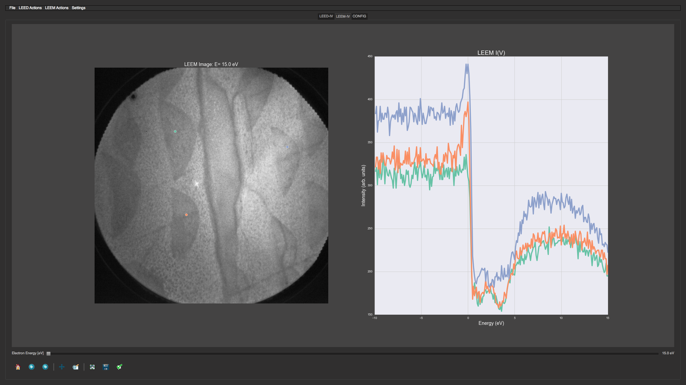
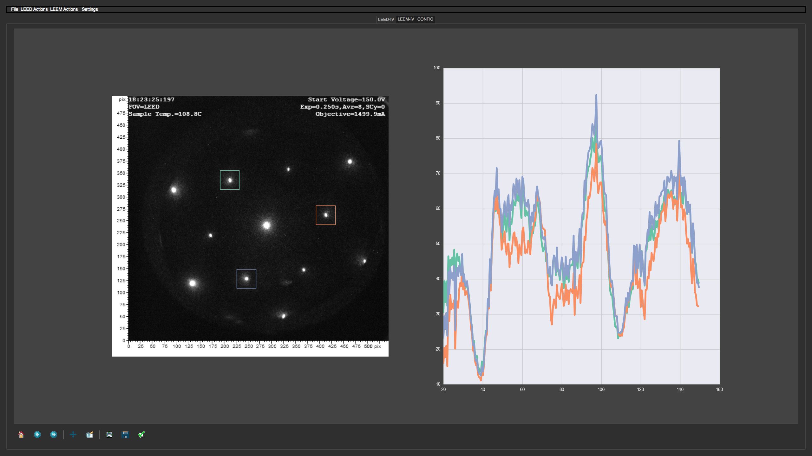

# PLEASE: Python Low-energy Electron Analysis SuitE

#### Author: 
**Maxwell Grady** University of New Hampshire Department of Physics Doctoral Candidate

## What is it?
**PLEASE** is a software package built for analysis of Low Energy Electron Microscopy data sets with specific emphasis on anlysis of IV data sets. The software is written in python using the PyQt4 python bindings for the C/C++ graphics framework Qt. All of my source code is freely available to view, modify and distribute.

## Why is it?
After working on a LEEM experiment I had some time before my next experiment was going to begin while waiting for some new hardware to arrive. I had collected a large amount of LEEM data but when returning to my research facility had no software able to easily read and analyze the data. Thus I set out to create my own as a way to teach myself about scientific software development and data analysis. The data analysis performed with this software will play a role in my doctoral thesis.

LEEM is a powerful surface science tool for analysis of real space and reciprocal space images of a surface. LEEM provides realspace resolution below 10nm, can rapidly switch between real space and reciprocal space imaging by swapping which focal plane is projected from the sample to the imaging column, and can restrict the LEED beam size to the sub-micron range (micro-LEED). LEED and LEEM IV data sets, when combined with dynamical surface structure calculations, can be used to determine the precise three dimensional atomic positions of the sample surface structure.

## What can it do?
PLEASE is specifically built to analyze LEEM-IV and LEED-IV data sets but can also be used as a simple image viewer for LEEM/LEED data which is not organized by energy. 

Data sets can be loaded for analysis from raw data binary (.dat), as well as from TIFF, PNG, and JPG. Loading raw data has the least amount of overhead and is prefered however the aforementioned image types are supported and flattened to gray scale automatically. Image color depths of 8bit and 16 bit are supported with future hopes to extend this to alternate image configurations.

####The necessary info for loading a data set is as follows:
* Image parameters:
	* Image Height
	* Image Width 
	* Bit Depth {16bit or 8bit: only required for loading raw data; defaults to 16-bit}
* Energy Parameters (in eV):
	* Starting Energy
	* Final Energy
	* Step Energy

Generally when loading a data set, the user is queried for the above settings, however, 
a *convienient* method for loading data sets as an experiment with saved parameters is implemented using YAML config files.

The user can store experimental parameters in a .yaml file as human readable structured text using the format given in the template file provided with the source code. This makes anlayzig many sets of data easier as you do not need to remember which parameters to enter for each separate data set

When data is loaded, PLEASE makes it easy to extract IV curves using a simple point and click method. Multiple curves can be extraced and plotted simultaneously with color coding displaying where on the image the dat was extracted from - This feature is shown for a LEEM data set in **Figure 1** with unsmoothed IV data from 50 micrometer FOV LEEM real space image of Graphene grown on Ruthenium(0001):

IV curves can be smoothed using a method of convoluton with a known window function. The provided window functions are: Flat (moving average / boxcar average), Hanning, Hamming, Blackman, and Bartlett.

IV curves can be averaged together. Curves can be popped out of the main window into a separate window so they can be saved as images. 

Curves can be saved to tab delimited text files which can then be plotted in another program such as gnuplot.

For LEEM data, IV curves are generated from single pixels in an image stack. For LEED data, IV curves are generated from an adjustable size square integration window. Basic background subtraction is provided for LEED data by subtracting out the perimeter sum of the integration window on each energy step.

An example of LEED-IV data is shown in **Figure 2** with unsmoothed IV data from MoS2:

The LEEM and LEED data tabs are separate so two data sets can be loaded at the same time. This is beneficial for analyzing real space and reciprocal space data from the same surface area.

## Requirements
**PLEASE** is written in python using the standard scientific stack alongside a number of other modules and libraries for convienience.

The python dependencies are as follows:

* Python 2.7, 3.4, 3.5 - Other versions of python have not been tested
* Numpy
* Scipy
* opencv
* PyQt4
* matplotlib
* seaborn
* yaml
* qdarkstyle

All of the above modules are freely available and can be easily installed using some combination of Pip or Conda

## Installation / Usage
**PLEASE** has been tested on the following operating systems:

* OS X versions 10.11 (El Capitan), 10.10 (Yosemite), and 10.9 (Mavericks)
* Linux - Ubuntu version 14 and 15, and Debian (version unknown)
* Windows versions XP and 10
* While I do not have access to other machines to test, PLEASE should run on nearly all modern operating systems which support python 2.7 and higher

The easiest way to use PLEASE is to setup a python virtual environment using pyenv or conda, install all the listed requirements using conda or pip to the virtual environment, then simply execute 'python main.py'

It is highly recommended to use the anaconda python distrobution if you are uncertain about how to install the required packages. Anaconda comes with nearly all the needed packages. Qdarkstyle can be installed with ease using pip. Opencv will need to be installed from any of the available public conda channels, or it can be built from source, however, this is beyond the scope of this installation guide

It is possible to package the PLEASE code, a python interpreter, and all required python modules as well as system linked libraries into an app file which can be executed like a normal program. I have tested this functionality using pyintaller on OS X, Linux, and Windows. However a detailed instruction on how to do so is beyond the scope of this guide. To save space, only the source code is provided as opposed to any pre-built executables. The portability of executables is low, they can only be built on one operating system, targeting that operating system. Thus an executable built on Ubuntu may not work on any other linux distrubution and likewise for other operating systems.

### System Requirements
It is suggested to run PLEASE on a machine with 4Gb or more RAM.
Loading multiple data sets at one time can easily use up to 1Gb of RAM depending on the size of the files being lodaded and the number of images in a given data set.

Most functionality should not be CPU intensive thus any modern cpu > 1.5GHz should suffice.

PLEASE has not been tested on any mobile devices nor on any CPUs outside of AMD and Intel's standard line. ARM is not officially supported and has not been tested.

#Contact
For questions, comments, and concerns **PLEASE** feel free to contact me at max.grady@gmail.com or by opening an issue on the main GitHub Repository: [Github](http://www.github.com/mgrady3/pLEASE "PLEASE")

####Closing remarks
**PLEASE** is a work in progress and is constantly being updated with bug fixes, quality of life improvements, as well as the occassional new functionality. Any and all contributions to the project are welcome! If there is a feature you would like to see implemented or a bug that needs fixing, don't hesitate to contact me

